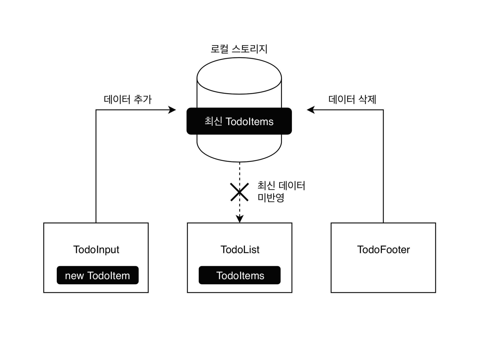
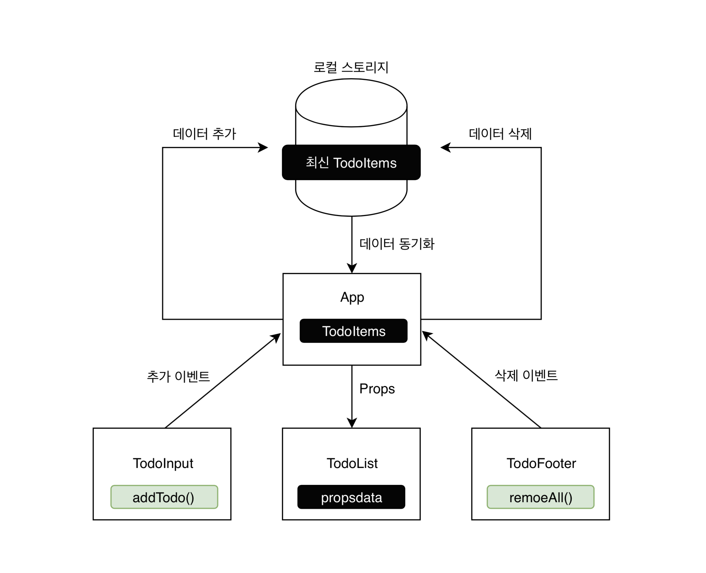

#### 현재 app 구조

`TodoInput`에서 `newTodoItem`의 데이터를 받아서 추가 -> 로컬스토리지에 새로 생김 -> `TodoList`에 바로 반영이 안된다(새로고침해야만 반영). 분리된 구조.




#### 개선한 app구조
`TodoInput`, `TodoList` 등 하위 컴포넌트는 표현만 할 것. 실질적인 기능 동작은 상위 컴포넌트인 `App`에서 이루어지도록 한다. `App` 컴포넌트에서는 props로 속성만 내릴 것.
하위 컴포넌트에서 신호를 받았을 때 제어하는 구조.



`App`의 경우에는 Container라는 개념으로 보면 된다.
컴포넌트 설계 관점으로 보면 컴포넌트에도 
단순히 화면에 표현하기만하는 컴포넌트가 있는가하면(presentor),
앱의 동작 등의 데이터 조작을 하는 걸 container라고 함

이렇게 하면 한 곳에서 관리를 할 수 있게되어 각 이벤트별로 분리/해당 내용을 props로 내려주기만 하면 전체적인 컴포넌트 동작을 매끄럽게 이을 수 있다.


템플릿 작성시 하나의 ```<template>``` 안에는 한 개의 root 태그만 있어야 한다. 

## slot 
특정 컴포넌트의 일부 UI들만 재사용할 수 있는 기능. '재정의'하는 관점에서 slot을 사용한다. 
Modal 중에서 케이스가 나뉘는 경우, slot으로 같은 컴포넌트를 재사용하는 것.

Modal.vue

     <slot name="header"> default header</slot>

TodoInput.vue

    <h3 slot="header">custom header</h3>
